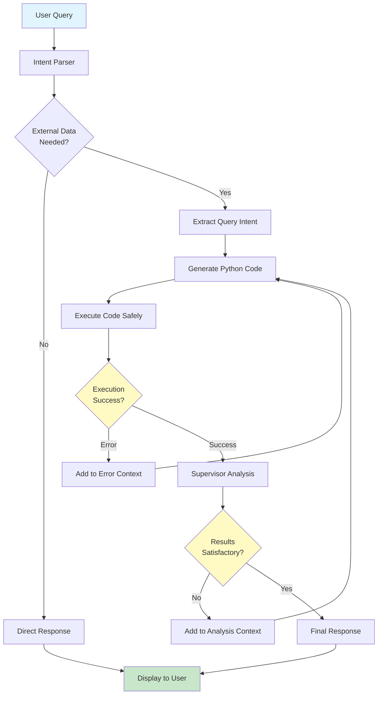

# external-data-gallery
[](https://github.com/cohere-llc/external-data-gallery/blob/main/LICENSE)
[](https://github.com/cohere-llc/external-data-gallery/actions/workflows/notebook-tests.yml)
[](https://mybinder.org/v2/gh/cohere-llc/external-data-gallery/HEAD?filepath=notebooks)

Gallery of scripts for working with 3rd party data providers

The gallery is organized into two sections.

## Examples

In `examples/` are complete scripts used for specific research applications that have been contributed to the gallery. They often make use of data from several providers and in a number of formats. They are typically in Python or R and can include complex data processesing steps. Instructions for running the scripts are included in a `README` for each example.

## Notebooks

In `notebooks/` are simplified scripts in Jupyter notebooks intended to demonstrate how to interact with one data provider, protocol, or file format. Click the `binder` badge above to try them out in an interactive Jupyter environment. (Valid credentials may be required for some data providers.)

## Agent

Also included is a prototype AI Agent for querying external datasets. To use the agent, you must have `uv` and `python3` installed locally. To clone the repo and run the agent:

```
git clone https://github.com/cohere-llc/external-data-gallery.git
cd external-data-gallery
uv sync
uv run streamlit run app.py
```

You should be redirected to a browser window where you can interact with the agent. You will need to have an Anthropic
Claude account (see: https://console.anthropic.com/). Once you have an account, you will need to create an API key (https://console.anthropic.com/settings/keys) that you will use to power the agent. Keep an eye on your token usage!
The agent can burn through your tokens pretty quickly.

Once you're finished, use `Ctrl-C` in the terminal window to shut down the streamlit service.

### How It Works

The agent uses a multi-step workflow powered by Claude Sonnet 4.5:



**Workflow Steps:**

1. **Intent Parsing** - Claude analyzes the natural language query to determine if external data is needed
2. **Query Planning** - If needed, breaks down the request into structured sub-queries with data sources, filters, and aggregations
3. **Code Generation** - Generates Python code using Dask, Zarr, and other libraries to execute the query
4. **Safe Execution** - Runs the generated code in a sandboxed environment with restricted imports
5. **Supervisor Review** - Claude reviews the results to verify they answer the original question
6. **Iterative Refinement** - If errors occur or results are unsatisfactory, the agent retries with context (up to 10 attempts)
7. **Response** - Returns the final results with code, logs, and visualizations

**Currently Supported Data Sources:**
- **NASA POWER** - Global weather and solar data
- **GBIF** - Global biodiversity occurrence records

### Example Queries

Try asking:
- "What was the average annual temperature in Los Angeles from 2010 to 2019?"
- "How many observations of polar bears are recorded in GBIF?"
- "Show me temperature data for New York City in January 2020"

NOTE: GBIF is huge and there the queries generated are often not optimized. It might run forever and try to download many GB of data.
