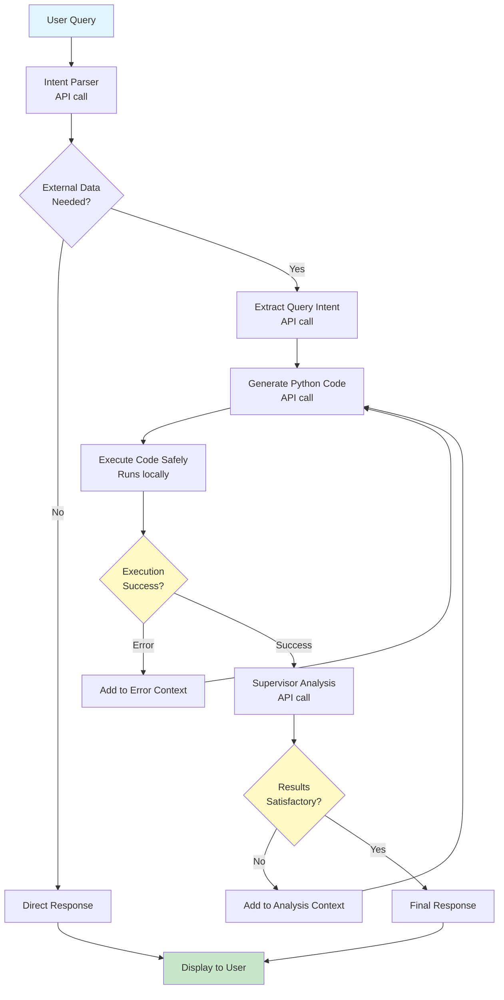

# Recommendations for External Data Agent

## Summary

The goal is to support user access to a variety of external scientific data sets, including via an AI agent. We performed a preliminary investigation by creating a prototype AI agent with prompts for the NASA POWER and GBIF data sets using the Anthropic Python API. Key takeaways were that little software development was required to create this prototype agent; the quality of the example queries provided as prompts had large effects on the ability of the agent to return results; and multiple requests using the same prompt gave different results indicating robust verification of results is critical.

Moving forward, we recommend exploring an approach centered around collecting, refining, and documenting query scripts from the user community. Contributed scripts should be real-world examples of queries that were used to answer actual research questions. Curated scripts would be published as a gallery of Jupyter Notebooks that users with scripting experience could use as templates for their own research questions. The gallery would also be used to further explore development of a dedicated AI agent tasked with performing queries for any user, regardless of scripting experience. Rapid deployment and incremental improvement are key advantages to this gallery-based approach to user support.

We also strongly recommend against deploying any AI agent for production use in research until a robust verification of all agent responses is possible.

Users could be asked something along these lines:

> We are attempting to collect examples of queries KBase users have written to answer specific research questions that involved interacting with data-providing services (e.g., via REST APIs, python packages, Google Earth Engine, AWS Data Exchange). Our goal is to develop a curated gallery of example scripts in Jupyter Notebooks that community users can use as recipes. We also plan to use the examples to train an AI agent that could assist users with these types of research questions.
> 
> If you have developed scripts like these in the past and would be willing to contribute them to this effort, please provide the script and a short description of its intent. The script can be in any language and does not have to run. KBase developers will port the original scripts to Python in a Jupyter Notebook, debugging and adding any necessary documentation in the process. Gallery examples will be released under the MIT license and you will retain the copyright on your original script.

## Methodology

We used the [Anthropic Python API library](https://github.com/anthropics/anthropic-sdk-python) to create a prototype agent for discovery of scientific data from publicly available sources. We used the [AWS NASA POWER dataset](https://power.larc.nasa.gov/docs/services/aws/) and the [pygbif python package](https://pygbif.readthedocs.io/en/latest/index.html) as surrogate data sources.

We arbitrarily chose the Anthropic python package to develop this prototype, but expect that similar results would be obtained using other approaches. We used the Claude Sonnet 4.5 model for the evaluation.

The prototype is available in the same repository as this document. To try it out, you will need to have `git` and `uv` installed locally. Then, from a terminal run:
```
git clone https://github.com/cohere-llc/external-data-gallery.git
cd external-data-gallery
uv sync
uv run streamlit run app.py
```

You can then interact with the agent in a browser after creating a [Claude API token](https://platform.claude.com/). (It's not free! Make sure you monitor your usage. In our tests individual questions involving queries cost ~$0.20.)

The agent code is available in the same repository as this document.

| Source File | Description |
|-------------|-------------|
| `src/external_data_gallery/agent.py` | top-level agent query function and general support functions |
| `src/external_data_gallery/sources/gbif_pygbif.py` | prompts for species occurrence data queries via pygbif |
| `src/external_data_gallery/sources/nasa_zarr.py` | prompts for environmental data queries via the AWS NASA POWER S3 bucket in Zarr format |
| `app.py` | A simple [streamlit](https://streamlit.io) app for interacting with the agent |

### Agent Workflow

The overall workflow for each request is shown below. The workflow uses a small team of agents with dedicated roles and collects output at each step, which are used in the final response to the user. Generated code is run locally. Queries are retried up to 3 times if technical errors or problematic results are encountered.




## Results

Note that this was a short-term exploration without prior experience developing AI agents. We include in the Roadmap aspects of agent development that should be investigated further before deciding on a path forward.

We tried asking the same question several times to see how consistent the results were (restarting the app after each request). Results are shown below.

**Prompt** : _"what was the temperature, pressure, and elevation at the location of each puma sighting in the 2010s averaged by month of the year?"_

| Attempt | Overall result |
|---------|----------------|
| 1       | Returned monthly temperature, pressure, and elevation. No reported errors |
| 2       | No Results. Technical errors on initial attempts, Final query attempt ran but returned 0 results. |
| 3       | Returned monthly temperature, pressure, and elevation. Technical errors on initial attempts. |
| 4       | No Results. Technical errors on all 3 attempts. |
| 5       | Returned temperature and pressure (no elevation). Technical errors on initial attempts. |
| 6       | Returned temperature, pressure, and elevation. Technical errors on initial attempts. |
| 7*      | Returned temperature, pressure, and elevation. Technical errors on initial attempts. |

\* Note that no changes to the internal agent prompts were made for Attempts 1&ndash;6. For Attempt 7, units were added to the prompts describing NASA POWER data.

Results for temperature, pressure, and elevation from "successful" attempts are shown below. (Note that some results give units of Pa for pressure and others give hPa, but all results are of the same order of magnitude.)

### Temperature (K)
| Month | Attempt 1 | Attempt 3 | Attempt 5 | Attempt 6 | Attempt 7** |
|-------|-----------|-----------|-----------|-----------|-------------|
| Jan   | 9.4385    | 9.3493    | 9.4482    | 9.816     | 13.6603     |
| Feb   | 10.7201   | 10.6088   | 10.7525   | 10.3744   | 14.3562     |
| Mar   | 12.3049   | 11.9189   | 12.1278   | 11.833    | 14.2158     |
| Apr   | 13.2511   | 13.2511   | 13.2811   | 14.0969   | 15.3639     |
| May   | 19.5399   | 19.5399   | 19.5749   | 19.7242   | 15.078      |
| Jun   | 19.5731   | 19.5371   | 19.6753   | 19.4794   | 17.8033     |
| Jul   | 17.6645   | 17.4897   | 17.3551   | 17.8445   | 19.6809     |
| Aug   | 19.9247   | 19.35     | 19.6907   | 19.744    | 19.5869     |
| Sep   | 19.5448   | 19.3813   | 19.714    | 19.6729   | 18.4797     |
| Oct   | 18.613    | 18.5692   | 18.5486   | 18.4934   | 15.9093     |
| Nov   | *         | *         | *         | *         | *           |
| Dec   | *         | *         | *         | *         | *           |

\* data clipped in output pdf<br/>
\** added units to NASA prompts

### Pressure (various units)
| Month | Attempt 1 (Pa) | Attempt 3 (Pa) | Attempt 5 (hPa) | Attempt 6 (hPa) | Attempt 7** (hPA) |
|-------|-----------|-----------|-----------|-----------|----------|
| Jan   | 902.6182  | 903.1789  | 903.30351 | 902.6143  | 916.067  |
| Feb   | 880.024   | 880.0717  | 880.0417  | 880.3287  | 899.1162 |
| Mar   | 891.49    | 889.5402  | 891.109   | 891.7193  | 897.4279 |
| Apr   | 882.9286  | 882.9286  | 882.9531  | 882.2503  | 888.8796 |
| May   | 910.3003  | 910.3003  | 910.2349  | 910.3306  | 920.2696 |
| Jun   | 916.4447  | 916.4447  | 915.1255  | 915.176   | 906.0624 |
| Jul   | 906.0741  | 911.3964  | 911.6863  | 905.9903  | 899.5745 |
| Aug   | 939.3937  | 938.2289  | 940.374   | 939.2852  | 906.5546 |
| Sep   | 927.9253  | 927.5641  | 927.9423  | 927.8527  | 914.2056 |
| Oct   | 910.7564  | 913.6369  | 912.1374  | 911.5775  | 903.533  |
| Nov   | *         | *         | *         | *         | *        |
| Dec   | *         | *         | *         | *         | *        |

\* data clipped in output pdf<br/>
\** added units to NASA prompts

### Elevation (m)
| Month | Attempt 1 | Attempt 3 | Attempt 5 | Attempt 6 | Attempt 7** |
|-------|-----------|-----------|-----------|-----------|-------------|
| Jan   | 489.8214  | 489.8214  | -         | 684.51    | 684.51      |
| Feb   | 910.7917  | 835.3286  | -         | 1437.5145 | 1437.5145   |
| Mar   | 1276      | 1295.7143 | -         | 1558.3816 | 1558.3816   |
| Apr   | 535.6     | 535.6     | -         | 1290.0694 | 1290.0694   |
| May   | 853.0928  | 853.0938  | -         | 1079.9632 | 1079.9632   |
| Jun   | 977.01790 | 977.0179  | -         | 1543.1184 | 1543.1184   |
| Jul   | 310.5882  | 310.5882  | -         | 1777.0333 | 1777.0333   |
| Aug   | 437.78    | 437.78    | -         | 1399.4167 | 1399.4167   |
| Sep   | 874.46    | 835.8958  | -         | 1545.5781 | 1545.5781   |
| Oct   | 1038.7813 | 968.6786  | -         | 1616.7537 | 1616.7537   |
| Nov   | *         | *         | -         | *         | *           |
| Dec   | *         | *         | -         | *         | *           |

\* data clipped in output pdf<br/>
\** added units to NASA prompts

### Common Technical Errors

* Incorrect function parameter names (most common)
* Datetime format and time zone mismatches
* Looking for elevation in NASA dataset instead of GBIF

## Analysis

### Things the agent was generally good at
* Returning responses that could be interpreted as generally understanding the question and creating a reasonable plan for using the NASA POWER and GBIF datasets to form an answer.
* Responding to internal API calls in such a way that the app could run the generated python code and fill in the response template (Summary / JSON query description / Generated Code / Results)

### Things the agent was generally bad at
* Returning consistent results
* Communicating key assumptions made about, e.g. units, naming conventions, etc.
* Inferring missing information correctly (e.g., units)

## Key Takeaways

### Development
* The process of creating the prototype agent involved very little software development. The primary activity was assembling instructions and examples that are used to give context to user queries. Note that the two files under `src/external_data_gallery/sources` that contain data-source specific instructions and examples are almost entirely text. and the top-level agent code `src/external_data_gallery/agent.py` is more than 50% text.
* Structuring the API calls around specific tasks (formulating a querying strategy, writing code, checking results) was more successful than initial attempts with fewer API calls.
* Iteration improves chances of getting results (several of the Attempts returned results on the 2nd or 3rd iteration)

### Verification
* Running the python scripts locally allows for follow-up verification of the methodology, but someone would have to actually do this. _Someone capable of assessing the quality of the generated code may spend less time generating the scripts themselves._
* The variety in the results (with no two attempts returning identical results, and dramatic differences in several cases) indicates there are many ways to create python scripts that do actual queries of NASA and GBIF data, which look reasonable at a high-level, and return results that don't stand out as obviously wrong, but are incorrect (assuming there is one correct answer to this question).

### Prompting
* The Claude documentation's [Prompting Best Practices](https://platform.claude.com/docs/en/build-with-claude/prompt-engineering/claude-4-best-practices) suggest that prompts are model and model-version specific. What works well for one model or model version may not work as well for others.
* The quality of the example scripts is important. Initially, the prompts for `pygbif` (which were copied directly from their documentation) contained some out-of-date information. This lead to repeated failures during attempts to query GBIF data. Similary, the prompts for NASA POWER did not include units for pressure and in some cases the agent assumed they were in Pa and other times used hPa (which were the correct units.)
* Getting something to run and return results can be done quickly. Getting higher quality responses will likely involve gaining experience with:
  * Prompt caching, particularly for general-use prompts like the gallery examples
  * Behavior and management of the context window
  * Generating and validation citations
  * Asynchronous API calls that share context
  * Effective use of "tools" (client- and server-side)
  * Resource management

## Roadmap

A draft roadmap with initial steps for development of User Support for External Data Sources is provided here.

1. Information Gathering
   1. Collecting user scripts
   2. Evaluating AI Models (e.g., Claude Sonnet 4.5)
   3. Exploring Agent development packages (e.g., Anthropic Python API)
   4. Assessing existing or in-development Agents for similar research applications
2. Beta Gallery and Proto-Agent Development
   1. Translating, refining, documenting, and releasing user scripts for beta users
   2. Prototype agent and create development plan with approach for:
      1. Ingesting gallery examples
      2. Incorporating new data sources
      3. Making optimal use of agent features for caching, tool use, performance
      4. Vetting Results
      5. Accurately citing sources

